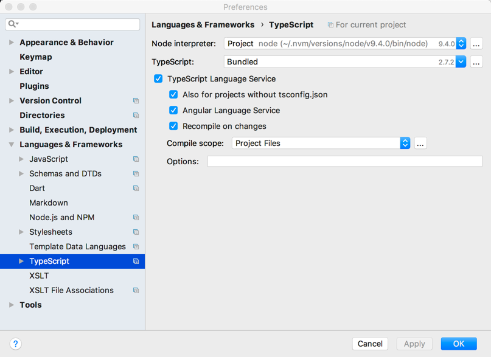
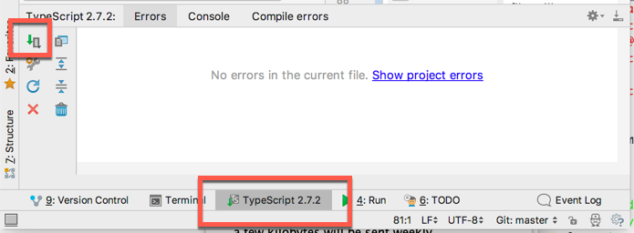

# ase2-typescript-01

Contains source code snippets of the TypeScript slides.
The file numbers in the src folder are corresponding with the chapter numbers
of the slides.

<br/>

**Content**

* 01-Variables
* 02-Types
* 03-Template Strings
* 04-Objects
* 05-Functions
* 06-this
* 07-Arrays und Iterables
* 08-Higher order functions
* 09-Closure (Funktionsabschluss)
* 10-Classes
* 11-Decorators
* 12-Destructing (Zerlegen)
* 13-Promise
* 14-Enums

<br/>

## Install Typescript

To run these code samples download Node.js from https://nodejs.org (use the latest version) and install it.
Then clone or download this repo into any directory on your computer.
In the command window, change into this directory .

**Prerequisites:**

* node.js
* npm

<br/>

**Installation**

Clone the git-Repo

    git clone https://github.engineering.zhaw.ch/bacn/ase2-typescript-01
    cd ase2-typescript-01

For npm-users:

    npm install
    npm install -g typescript

<br/>

## Transpile and run from console


At the command line, run the TypeScript transpiler:


    tsc 00-run.ts

The result will be a file **00-run.js** which contains the transpiled JavaScript. Because of the
import statement of the files from the **src folder**, all typescript file will get
transpiled.

Now we are ready to run the transpiled JavaScript file with **node**:

    node 00-run.js

<br/>

## Transpile and run with WebStorm

Install Webstorm from here

https://confluence.jetbrains.com/display/WI/WebStorm+EAP 

## Enable the TypeScript Service

Open the Properties window and filter for TypeScript



## Open the TypeScript Tool Window and Compile (Transpile to js)

In the WebStrom menu choose View->Tool windows->TypeScript



Press the compile button in the TypeScript tool window. You can recognize that all *ts files get an arrow.

## Run the TypeScript files with Webstorm

* Open Webstrom and press Open [File Open]
* Navigate to the folder with the typescript files
* In the Webstrom project view open the file **00-run.ts**


### Create a run configuration
* Klick in the Menu on Run->Run...
* In the dialog press [Edit Run Configurations]
* In the Edit Run Configuration dialog press **[+]** and select **node.js**
* In the **name field** enter a title
* In the JavaScript field choose the file  **00-run.js**


### Run the compiled JavaScript file
* Click [Apply] and [Run]
* The console shows the output of the different code snippets

<br/>


# Exercises

## Preparation

Create a folder `src/ex` and create in the folder 5 files like `ex01.ts`, `ex02.ts`, `ex03.ts`, `ex04.ts`, `ex05.ts`.  
Each file shall contain a function like:

File `ex01.ts`:

``` typescript

export function ex01() {
    
}
```
File `ex02.ts`:

``` typescript

export function ex02() {
    
}
```
File `ex03.ts`:

``` typescript

export function ex03() {
    
}
```

... and so on for the other 2 files.

Create a file `ex-run.ts` in the root folder (like 00-run.ts). Start the ts-node
transpiler with `npm run tsc`. 

Create a function run:

``` typescript
import {ex01} from './src/ex/ex01';
import {ex02} from './src/ex/ex02';
import {ex03} from './src/ex/ex03';
import {ex04} from './src/ex/ex04';
import {ex05} from './src/ex/ex05';
run();

function run() {
    ex01();
    ex02();
    ex03();
    ex04();
    ex05();
}
```

## Exercise 1 - Fruit salad

### a) Create a fruit salad object

Create a fruit salad object with the name:

```typescript
let fruitSalad = {};
```

The fruit salad consists of the attributes apple, pear and kiwi. Each attribute
shall contain a string like `I am an apple` or `I am a pear`. Make each attribute 
visible to the console.


### b) Modify the attributes

Modify the attribute apple. The attribute shall contain a function, accepting an argument e.g. msg. 
The function shall output to the console `'apple' + msg` and return a string `'return from apple'`. 

Modify the attribute pear. The attribute shall contain a function, accepting no argument 
The function shall output to the console `'pear'` and return a number `2`. 

Call the attribute apple, pear and kiwi. Output the result to the console.

### c) Create an interface IFruitSalad

The interface `IFruitSalad` shall contain the attributes  apple, pear and kiwi. Use in the beginning
the type `any`.

```typescript
let fruitSalad: IFruitSalad = { ..  .. .. ..};
```

Check if if compiles .. 

Then modify the interface types to a more appropriate type. 


### d) Modify kiwi to programmatically assign a function

kiwi contains still string with the content `I am a kiwi`. Assign a function like:

```typescript
{
    return 'i am now a new return from kiwi';
};
```

Modify the type in the interface.

### e) Create an array of fruitsalad

The fruitsalad object shall be an array

```typescript
let fruitSalads: Array<IFruitSalad> = [{ ..  .. .. ..}];
```

Iterate through the array members with:

```typescript
    fruitSalads.forEach ((fruitSalad) => {
        
    });
```

## Exercise 2 - Date - ex02.ts

- a) Create the current date and make an output to the console. 
- b) Try to format the date with the function `.toLocaleDateString()`. Unfortunately it doesn't work. 
- c) Use the date member functions `.getDate()`, `.getMonth()`, `.getFullYear()` to output a proper date
- d) Install the moment library and @types/moment with `npm i moment --save` and `npm i @types/moment --save-dev`. Import the 
library with `import * as moment from 'moment';`. 

Try to use moment to format the date:
```typescript
    moment.locale('de');
    // let value = "2019-09-04 10:00:00";
    let value = "2019-09-04T10:00:00Z";
    const dateLocale: moment.Moment = moment.utc(dateobj).local();
```

Output the result to the console.

## Exercise 3 - Higher order functions - ex03.ts

### a) Create a function which accepts a function as an argument

Create a function `doubleF(n: number): number`. Return  `n * 2`.

Create a function `halfF(n: number): number`. Return  `n / 2`.

Create a function with the name `twoMoreF()`. This function accepts two arguments: a number and a calculate function. 
`twoMoreF` calls itself the calculate function e.g. `doubleF` or `halfF`, and passes the number as argument to it. Then it adds 
the constant `2` to the result of the calculate function. It returns the result to the caller.

Call `twoMoreF()` and output the result to the console.

```typescript
   console.log("TWO MORE F", twoMoreF(4, halfF));
```

### b) Create a function which returns a function

Create a function `getDoubleF()` with returns the function `doubleF`. Call the function with: 

```typescript
    console.log("TWO MORE F", twoMoreF(4, getDoubleF()));
```

### c) Convert all functions to anonymous functions

Create the anonymous functions:

- double()
- half()
- getDouble()
- twoMore()

... with the correct types. And call them!

```typescript
    console.log("TWO MORE", twoMore(4, getDouble()));
    console.log("TWO MORE", twoMore(4, half));
```


## Exercise 4 - Promises - ex04.ts


## Exercise 5 - RxJS - ex05.ts
