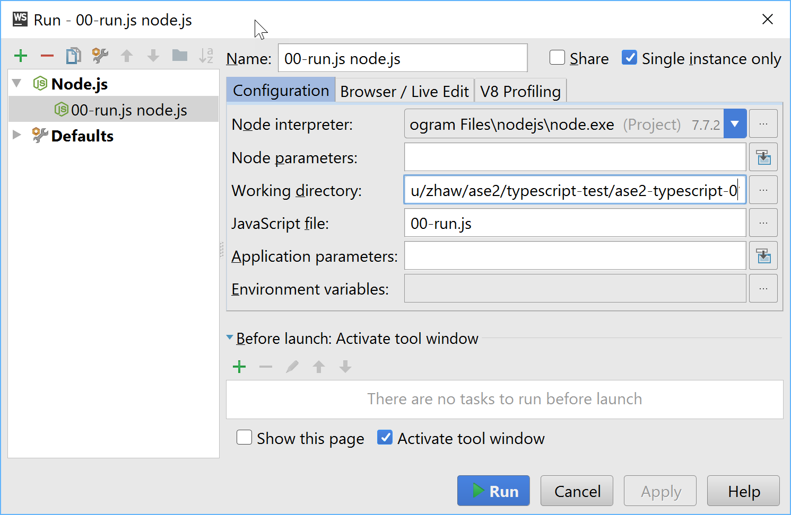

# ase02-typescript-sample

Contains source code samples.
The files numbers in the src folder correspond with the chapter numbers
of the slides.

 

**Content**

* 01-Variables
* 02-Types
* 03-Template Strings
* 04-Objects
* 05-Functions
* 06-this
* 07-Arrays und Iterables
* 08-Higher order functions
* 09-Closure (Funktionsabschluss)
* 10-Classes
* 11-Decorators
* 12-Destructing (Zerlegen)

 

## Install Typescript

**Prerequisites:**

* node.js
* npm

 

**Installation**

For npm-users:

    npm install -g typescript

 

## Compile and run from console

Clone the git-Repo

    git clone https://github.engineering.zhaw.ch/bacn/ase2-typescript-01
    cd ase2-typescript-01

At the command line, run the TypeScript compiler:

    tsc 00-run.ts

The result will be a file 00-run.js which contains the same JavaScript. Because of the
import statement of the files in the scr folder, all typescript file will get
compiled.

Now we are ready to run the compile JavaScript file with node:

    node 00-run.js

 

## Compile and run with WebStorm

Install Webstorm from here

https://confluence.jetbrains.com/display/WI/WebStorm+EAP

** Run the TypeScript files with the Webstorm

* Open Webstrom and press Open [File Open]
* Navigate to the folder with the typescript files
* In the Webstrom project view open the file 00-run.ts
* At the top right corner in the editor window press [OK] to compile TypeScript to JavaScrit
* Klick in the Menu on Run->Run...
* In the dialog press [Edit Run Configurations]
* In the name field enter a title or this run configuration
* In the JavaScript field enter 00-run.js
* Click [Apply] and [Run]

 

